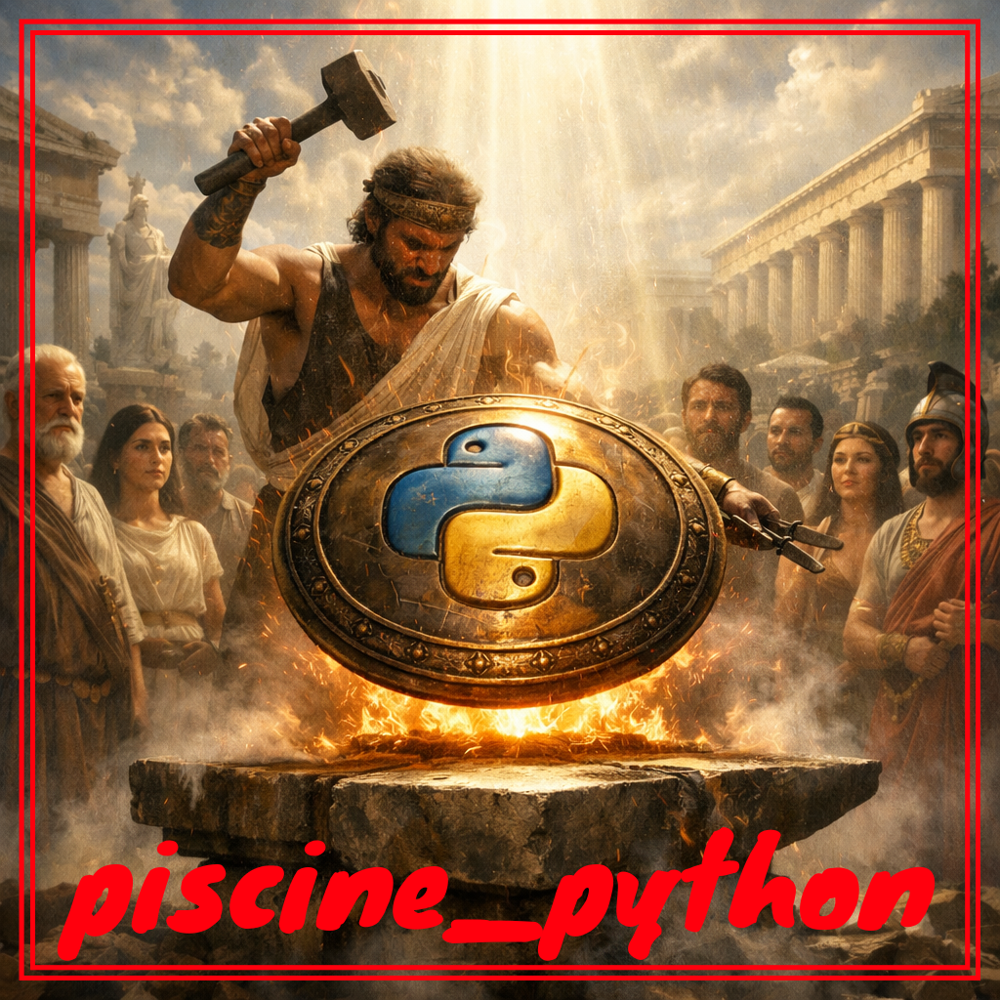

  

## 🚀 SYNOPSIS

The `piscine_python` repository is a collection of exercises and projects designed to help learners master Python programming. 

It covers a wide range of topics, from basic syntax and data structures to more advanced concepts like object-oriented programming and functional programming. Each exercise is designed to challenge your understanding and improve your coding skills.

## 🛠️ PROGRAM SPECIFICITIES AND CONSIDERATIONS

Project in construction 🚧

## ⚙️ USAGE

## 🤝 CONTRIBUTION
Contributions are open, open a Github Issue or submit a PR 🚀
